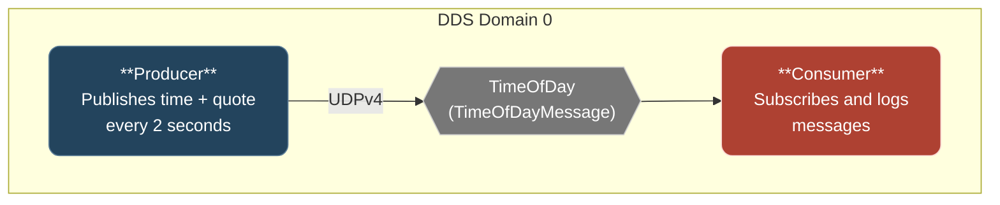
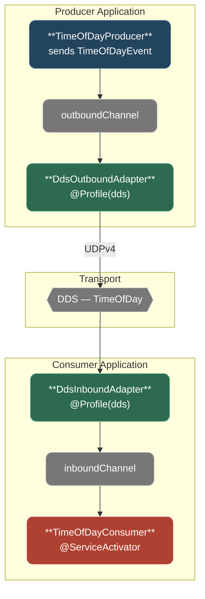
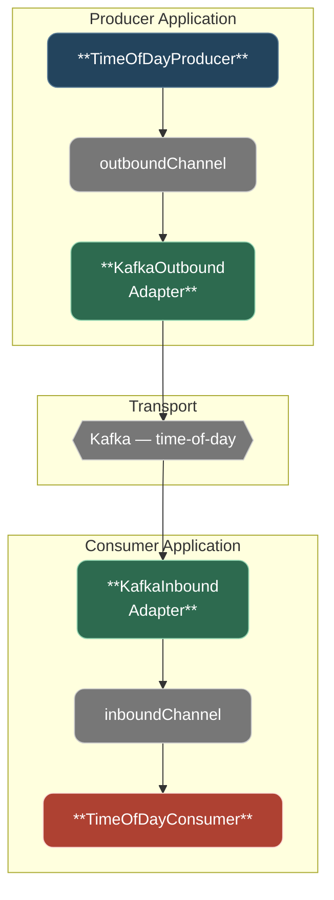
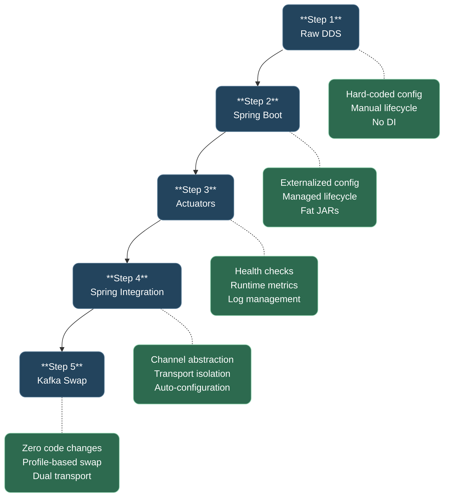

# Tutorial Overview: Modernizing a Legacy Java Messaging Application

> _"The true cost of software is not in its initial development, but in its ongoing maintenance."_
> --- Martin Fowler, [Refactoring](https://martinfowler.com/books/refactoring.html)

## Introduction

This tutorial demonstrates a pragmatic, incremental approach to modernizing a legacy Java application that uses [RTI Connext DDS](https://www.rti.com/products/connext-dds-professional) for real-time messaging. Over five steps, the application evolves from a tightly coupled, hard-to-operate codebase into a Spring-based system with pluggable messaging infrastructure --- all without rewriting from scratch.

The approach follows Martin Fowler's [Strangler Fig](https://martinfowler.com/bliki/StranglerFigApplication.html) pattern: rather than a risky big-bang rewrite, each step wraps and replaces a specific concern while preserving existing functionality. At every stage, the application continues to work.

### Who This Is For

- **Java developers** maintaining legacy middleware applications
- **Architects** evaluating incremental modernization strategies
- **Teams** considering a move from proprietary messaging to open-source alternatives

### What You Will Learn

- How to adopt Spring Boot without disrupting existing business logic
- How to add operational visibility to legacy applications
- How to decouple business logic from messaging infrastructure
- How to swap messaging transports through configuration alone

## The Starting Point

The baseline is a producer/consumer pair communicating over RTI Connext DDS --- a high-performance, standards-based messaging middleware used in defense, aerospace, and industrial IoT. The code is functional but exhibits the pain points common to legacy Java applications:



**Legacy pain points:**

| Pain Point               | Impact                                                    |
| ------------------------ | --------------------------------------------------------- |
| Hard-coded configuration | Any change requires recompilation and redeployment        |
| Manual DDS lifecycle     | Boilerplate setup/teardown code duplicated in each module |
| No dependency injection  | Components are tightly coupled and difficult to test      |
| No health monitoring     | No way to know if the application is running correctly    |
| No runtime diagnostics   | Log levels require a restart to change                    |
| Tight coupling to DDS    | Switching messaging requires rewriting business logic     |

## The Modernization Journey

### Step 1: Baseline --- Raw RTI DDS

**Branch:** `step-1` | **Key Concept:** Establish the legacy baseline

The starting point is intentionally minimal: two standalone Java applications communicating over DDS with no framework, no dependency injection, and no externalized configuration. Everything is wired by hand in `main()`.

This step exists to make the pain points visible. Each subsequent step addresses one or more of these concerns.

**Technologies:** Java 17, RTI Connext DDS, SLF4J/Logback, Maven

---

### Step 2: Spring Boot Adoption

**Branch:** `step-2` | **Key Concept:** Framework adoption

The first modernization step replaces the manual application scaffold with [Spring Boot](https://spring.io/projects/spring-boot), the de facto standard for building production-ready Java applications.

**What changes:**

- `@SpringBootApplication` replaces hand-wired `main()` methods
- `@Configuration` beans manage DDS entity lifecycle with `@PreDestroy` cleanup
- `application.properties` externalizes all configuration --- change behavior without recompilation
- `spring-boot-maven-plugin` produces self-contained fat JARs

| Concern           | Before (Step 1)                  | After (Step 2)                                    |
| ----------------- | -------------------------------- | ------------------------------------------------- |
| Startup           | Shell script assembles classpath | `java -jar` (fat JAR)                             |
| Configuration     | Hard-coded constants             | `application.properties` + command-line overrides |
| DDS lifecycle     | Manual shutdown hooks            | `@PreDestroy` via Spring context                  |
| Dependency wiring | Constructor calls in `main()`    | Spring constructor injection                      |
| Packaging         | Thin JAR + external classpath    | Self-contained fat JAR                            |

**Why this matters:** Spring Boot is not just a convenience --- it is the gateway to the entire Spring ecosystem. Adopting it here unlocks actuators (Step 3), Spring Integration (Step 4), and profile-based configuration (Step 5). This aligns with the [12-Factor App](https://12factor.net/) methodology, particularly factors III (Config), VI (Processes), and VII (Port Binding).

**Design patterns introduced:**

- [Dependency Injection](https://martinfowler.com/articles/injection.html) --- objects are wired by the framework, not by manual constructor calls
- [Inversion of Control](https://martinfowler.com/bliki/InversionOfControl.html) --- the framework manages the application lifecycle
- [Externalized Configuration](https://12factor.net/config) --- configuration is separate from code

---

### Step 3: Operational Visibility

**Branch:** `step-3` | **Key Concept:** Production readiness

[Spring Boot Actuators](https://docs.spring.io/spring-boot/reference/actuator/) add operational visibility without touching business logic. This is a purely additive step --- no existing code is modified.

**What changes:**

- Embedded Tomcat provides HTTP endpoints on configurable ports
- Health, metrics, logging, and configuration endpoints are exposed
- A custom `DdsHealthIndicator` reports DDS connection status
- [Micrometer](https://micrometer.io/) counters track messages published and received

| Endpoint | URL                 | Purpose                                         |
| -------- | ------------------- | ----------------------------------------------- |
| Health   | `/actuator/health`  | Liveness check with custom DDS health indicator |
| Info     | `/actuator/info`    | Application name, description, tutorial step    |
| Loggers  | `/actuator/loggers` | View and change log levels at runtime           |
| Metrics  | `/actuator/metrics` | JVM, process, and custom DDS message counters   |
| Env      | `/actuator/env`     | Resolved configuration properties               |

**Why this matters:** Operational visibility is a prerequisite for running any application in production. The ability to check health, inspect configuration, change log levels, and track metrics --- all without restarting --- transforms a black-box application into one that can be monitored, diagnosed, and managed. Organizations that have adopted actuator-based monitoring consistently report faster incident response and reduced mean time to recovery ([Spring Boot in Production](https://docs.spring.io/spring-boot/reference/actuator/endpoints.html)).

**Design patterns introduced:**

- [Health Check](https://microservices.io/patterns/observability/health-check-api.html) --- a dedicated endpoint reports application and dependency status
- [Observer Pattern](https://refactoring.guru/design-patterns/observer) --- Micrometer counters observe application events without coupling to the event source

---

### Step 4: Messaging Abstraction

**Branch:** `step-4` | **Key Concept:** Decouple business logic from transport

This is the pivotal step. [Spring Integration](https://spring.io/projects/spring-integration) introduces an abstraction layer between business logic and the messaging transport, implementing the patterns described in Gregor Hohpe and Bobby Woolf's [Enterprise Integration Patterns](https://www.enterpriseintegrationpatterns.com/).

**What changes:**

- Business logic sends and receives transport-neutral `TimeOfDayEvent` POJOs via named channels
- DDS-specific code is isolated in a `dds-support` module with profile-gated channel adapters
- `@Profile("dds")` controls which transport is active at runtime
- Auto-configuration makes transport modules self-registering



**Before and after:**

```java
// Step 3 — business logic coupled to DDS:
writer.write(ddsMessage, InstanceHandle_t.HANDLE_NIL);

// Step 4 — business logic sends a POJO to a channel:
outboundChannel.send(MessageBuilder.withPayload(event).build());
```

| Concern            | Before (Step 3)           | After (Step 4)                                |
| ------------------ | ------------------------- | --------------------------------------------- |
| Business logic     | Directly calls DDS API    | Sends/receives via channels, zero DDS imports |
| Transport swap     | Requires code changes     | Profile-based: change one property            |
| Message model      | DDS `TimeOfDayMessage`    | Transport-neutral `TimeOfDayEvent` POJO       |
| DDS code isolation | Mixed with business logic | Isolated in `dds-support` module              |
| Testability        | Requires running DDS      | Business logic testable with mock channels    |

**Why this matters:** Decoupling business logic from infrastructure is the single most impactful architectural change in this tutorial. It transforms messaging from a hard-wired dependency into a pluggable concern. This is the pattern that enables organizations to migrate from proprietary middleware to open-source alternatives incrementally, without a risky big-bang rewrite. Netflix, LinkedIn, and Uber have all documented similar migration strategies when moving between messaging systems ([Confluent: Apache Kafka Migration Patterns](https://developer.confluent.io/courses/architecture/migration/)).

**Design patterns introduced:**

- [Hexagonal Architecture](https://alistair.cockburn.us/hexagonal-architecture/) (Ports and Adapters) --- business logic defines ports (channels); adapters bridge to external systems
- [Channel Adapter](https://www.enterpriseintegrationpatterns.com/patterns/messaging/ChannelAdapter.html) --- bridges between application channels and external messaging systems
- [Message Channel](https://www.enterpriseintegrationpatterns.com/patterns/messaging/MessageChannel.html) --- named pipes that decouple producers from consumers
- [Service Activator](https://www.enterpriseintegrationpatterns.com/patterns/messaging/MessagingAdapter.html) --- a Spring bean that processes messages from a channel
- [Strategy Pattern](https://refactoring.guru/design-patterns/strategy) --- transport implementation is selected at runtime via profiles

---

### Step 5: Transport Swap --- Zero Code Changes

**Branch:** `step-5` | **Key Concept:** Configuration-driven infrastructure

The final step proves the abstraction works. Apache Kafka replaces RTI Connext DDS as the messaging transport --- **without modifying a single line of business logic**.

Kafka was chosen for this tutorial as a widely adopted, open-source messaging platform, but it is just one of many options. Spring Integration provides [channel adapters for a broad range of external systems](https://docs.spring.io/spring-integration/reference/endpoint-summary.html) --- including [JMS](https://docs.spring.io/spring-integration/reference/jms.html), [AMQP (RabbitMQ)](https://docs.spring.io/spring-integration/reference/amqp.html), [MQTT](https://docs.spring.io/spring-integration/reference/mqtt.html), [AWS SQS/SNS](https://docs.awspring.io/spring-cloud-aws/docs/current/reference/html/index.html#sqs-integration), [Apache Pulsar](https://docs.spring.io/spring-integration/reference/pulsar.html), and more. The same abstraction pattern used here would apply to any of them: write a new transport module, activate it with a profile, and the business logic remains untouched.

**What changes:**

- A new `kafka-support` module mirrors the `dds-support` pattern
- `application-kafka.properties` configures the Kafka transport
- Starting with `--spring.profiles.active=kafka` activates Kafka instead of DDS

**The zero-code-changes proof:**

These files are identical between Step 4 and Step 5:

- `TimeOfDayProducer.java` --- still sends `TimeOfDayEvent` to `timeOfDayOutboundChannel`
- `TimeOfDayConsumer.java` --- still receives `TimeOfDayEvent` via `@ServiceActivator`
- `IntegrationConfig.java` --- channels are transport-agnostic
- `TimeOfDayEvent.java` --- the POJO does not change
- All `dds-support/` files --- DDS transport still works

**Same business logic. Same channels. Different transport. One property change.**



**Why this matters:** The ability to swap messaging infrastructure through configuration alone is the payoff of every preceding step. It validates the architectural investment: Spring Boot provided the foundation, actuators ensured operational visibility, and Spring Integration created the abstraction layer. This is not a theoretical exercise --- it is the pattern used in production by organizations migrating from legacy middleware to cloud-native messaging platforms.

## Architecture Evolution



## The Complete Journey

| Step | What Changed                                     | Key Concept                         | Design Patterns                                   |
| ---- | ------------------------------------------------ | ----------------------------------- | ------------------------------------------------- |
| 1    | Raw RTI DDS, shell scripts, SLF4J logging        | Baseline legacy application         | ---                                               |
| 2    | Spring Boot, externalized config, fat JARs       | Framework adoption                  | Dependency Injection, IoC, Externalized Config    |
| 3    | Actuators: health, metrics, loggers              | Operational visibility              | Health Check, Observer                            |
| 4    | Spring Integration, transport auto-configuration | Messaging abstraction               | Hexagonal Architecture, Channel Adapter, Strategy |
| 5    | Kafka transport via profile swap                 | Configuration-driven infrastructure | (Validates patterns from Step 4)                  |

## Design Patterns Summary

This tutorial demonstrates the practical application of several well-established design patterns:

### Structural Patterns

- **[Hexagonal Architecture](https://alistair.cockburn.us/hexagonal-architecture/)** (Ports and Adapters) --- Business logic defines ports (message channels); transport-specific adapters bridge to external systems. This is the core architectural pattern that enables the transport swap in Step 5.

- **[Strangler Fig](https://martinfowler.com/bliki/StranglerFigApplication.html)** --- The overall modernization strategy. Each step wraps and replaces a specific concern without disrupting the rest of the application. The legacy system continues to function throughout.

### Behavioral Patterns

- **[Strategy Pattern](https://refactoring.guru/design-patterns/strategy)** --- Transport implementations (DDS, Kafka) are interchangeable strategies selected at runtime via Spring profiles. Business logic is unaware of which strategy is active.

- **[Observer Pattern](https://refactoring.guru/design-patterns/observer)** --- Micrometer metrics observe application events (messages published, messages received) without coupling to the event source.

### Enterprise Integration Patterns

From Hohpe and Woolf's [Enterprise Integration Patterns](https://www.enterpriseintegrationpatterns.com/):

- **[Message Channel](https://www.enterpriseintegrationpatterns.com/patterns/messaging/MessageChannel.html)** --- Named pipes (`timeOfDayOutboundChannel`, `timeOfDayInboundChannel`) decouple message producers from consumers.

- **[Channel Adapter](https://www.enterpriseintegrationpatterns.com/patterns/messaging/ChannelAdapter.html)** --- Bridges between application channels and external messaging systems (DDS, Kafka).

- **[Service Activator](https://www.enterpriseintegrationpatterns.com/patterns/messaging/MessagingAdapter.html)** --- Spring beans that process messages arriving on a channel, annotated with `@ServiceActivator`.

### Foundational Principles

- **[Dependency Injection](https://martinfowler.com/articles/injection.html)** --- The Spring container manages object creation and wiring.

- **[Inversion of Control](https://martinfowler.com/bliki/InversionOfControl.html)** --- The framework manages the application lifecycle, not the application code.

- **[Externalized Configuration](https://12factor.net/config)** --- Configuration is stored in the environment, not in the code.

## Key Takeaways

1. **Modernize incrementally.** Each step in this tutorial is a self-contained improvement that delivers value independently. You do not need to complete all five steps to benefit --- even adopting Spring Boot alone (Step 2) eliminates significant boilerplate and unlocks the broader ecosystem.

2. **Decouple before you swap.** The transport swap in Step 5 is trivial _because_ Step 4 established the abstraction layer. Attempting to swap DDS for Kafka without the channel abstraction would have required rewriting every component. Invest in the abstraction first.

3. **Operational visibility is not optional.** Step 3 adds zero business functionality, yet it transforms the application from a black box into something that can be monitored, diagnosed, and managed in production. This is table stakes for any application that runs beyond a developer's laptop.

4. **Configuration-driven infrastructure scales.** The profile-based transport selection in Step 5 is not just a demo trick --- it is a pattern that scales to production. Run DDS in environments where low-latency multicast is available; run Kafka where cloud-native messaging is preferred. Same artifact, different configuration.

5. **Patterns outlast frameworks.** The Hexagonal Architecture, Channel Adapter, and Strategy patterns demonstrated here are not Spring-specific. The principles apply regardless of whether you use Spring Integration, Apache Camel, MuleSoft, or any other integration framework.

## Technology Reference

| Technology                                                                        | Role in Tutorial                                  | Steps   |
| --------------------------------------------------------------------------------- | ------------------------------------------------- | ------- |
| [RTI Connext DDS](https://www.rti.com/products/connext-dds-professional)          | Legacy messaging transport                        | 1 --- 5 |
| [Spring Boot](https://spring.io/projects/spring-boot)                             | Application framework, dependency injection       | 2 --- 5 |
| [Spring Boot Actuators](https://docs.spring.io/spring-boot/reference/actuator/)   | Health, metrics, logging, configuration endpoints | 3 --- 5 |
| [Micrometer](https://micrometer.io/)                                              | Application metrics and counters                  | 3 --- 5 |
| [Spring Integration](https://spring.io/projects/spring-integration)               | Messaging abstraction, channel adapters           | 4 --- 5 |
| [Apache Kafka](https://kafka.apache.org/)                                         | Cloud-native messaging transport                  | 5       |
| [Spring Kafka](https://spring.io/projects/spring-kafka)                           | Kafka integration for Spring applications         | 5       |
| [Enterprise Integration Patterns](https://www.enterpriseintegrationpatterns.com/) | Architectural patterns for messaging systems      | 4 --- 5 |

## Further Reading

- Fowler, M. --- [Strangler Fig Application](https://martinfowler.com/bliki/StranglerFigApplication.html) --- The incremental migration strategy used throughout this tutorial
- Fowler, M. --- [Refactoring: Improving the Design of Existing Code](https://martinfowler.com/books/refactoring.html) --- The foundational text on improving legacy code
- Hohpe, G. & Woolf, B. --- [Enterprise Integration Patterns](https://www.enterpriseintegrationpatterns.com/) --- The patterns implemented by Spring Integration in Step 4
- Cockburn, A. --- [Hexagonal Architecture](https://alistair.cockburn.us/hexagonal-architecture/) --- The Ports and Adapters pattern that underpins the transport abstraction
- Wiggins, A. --- [The Twelve-Factor App](https://12factor.net/) --- Methodology for building modern, cloud-native applications
- Spring --- [Spring Boot Reference Documentation](https://docs.spring.io/spring-boot/reference/) --- Comprehensive guide to the Spring Boot framework
- Spring --- [Spring Integration Reference](https://docs.spring.io/spring-integration/reference/) --- Guide to Spring Integration channels, adapters, and patterns
