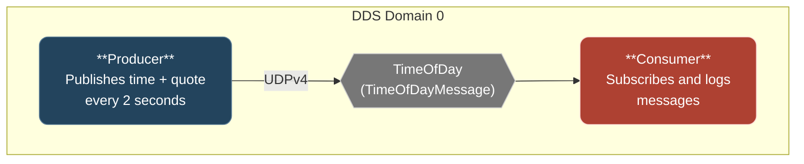

# Step 1: Raw RTI DDS Producer/Consumer

## Goal

Establish a baseline legacy application using RTI Connext DDS for messaging between two Java components — with minimal dependencies beyond the JDK.

This step deliberately avoids modern frameworks to illustrate the boilerplate and manual wiring that motivates the modernization in subsequent steps.

## What This Step Demonstrates

- Direct use of the RTI Connext DDS Java API
- IDL-defined structured message types with code generation via `rtiddsgen`
- Automated IDL code generation during the Maven build (no checked-in generated sources)
- Manual DDS entity lifecycle management (DomainParticipant, Publisher, Subscriber, Topic, DataWriter, DataReader)
- Application startup via shell scripts in a shared `demo/` directory
- Logging with SLF4J and Logback
- QoS configuration via `USER_QOS_PROFILES.xml`

## Architecture



### Message Structure (IDL)

```idl
struct TimeOfDayMessage {
    string timestamp;   // ISO 8601 format
    long messageId;     // Incremented starting from 1
    string quote;       // Quote of the moment
};
```

## Project Structure

```text
a-stultitia/
├── pom.xml                                  # Parent reactor POM
├── demo/
│   ├── README.md                            # Build & run instructions
│   ├── bin/
│   │   ├── run-producer.sh
│   │   └── run-consumer.sh
│   └── etc/
│       └── USER_QOS_PROFILES.xml            # DDS QoS configuration (UDPv4)
├── idl/
│   ├── README.md
│   ├── pom.xml                              # Runs rtiddsgen during generate-sources
│   └── src/main/idl/TimeOfDayMessage.idl
├── producer/
│   ├── README.md
│   ├── pom.xml
│   └── src/main/
│       ├── java/net/edwardsonthe/producer/TimeOfDayProducer.java
│       └── resources/quotes.txt
└── consumer/
    ├── README.md
    ├── pom.xml
    └── src/main/java/net/edwardsonthe/consumer/TimeOfDayConsumer.java
```

## Components

### IDL Module (`idl/`)

- **IDL file:** `src/main/idl/TimeOfDayMessage.idl`
- Defines the `TimeOfDayMessage` structured type in the `net.edwardsonthe.messages` package
- Java type support code is generated automatically by `rtiddsgen` during `mvn generate-sources`
- Generated sources go to `target/generated-sources/idl/` — nothing is checked into version control
- See [idl/README.md](idl/README.md) for details on the generated classes

### Producer (`producer/`)

- **Main class:** `net.edwardsonthe.producer.TimeOfDayProducer`
- Creates a DDS DomainParticipant, Publisher, and TimeOfDayMessageDataWriter
- Loads quotes from `quotes.txt` and cycles through them sequentially
- Publishes a `TimeOfDayMessage` (timestamp, messageId, quote) every 2 seconds
- Logs each publication via SLF4J/Logback
- Shutdown hook cleanly tears down DDS entities
- See [producer/README.md](producer/README.md) for details

### Consumer (`consumer/`)

- **Main class:** `net.edwardsonthe.consumer.TimeOfDayConsumer`
- Creates a DDS DomainParticipant, Subscriber, and TimeOfDayMessageDataReader
- Uses a `DataReaderAdapter` listener to receive messages asynchronously
- Logs each received message (all fields) via SLF4J/Logback
- Shutdown hook cleanly tears down DDS entities
- See [consumer/README.md](consumer/README.md) for details

## Prerequisites

- JDK 17+
- Maven 3.9+
- RTI Connext DDS 7.x (Express or Professional) with `NDDSHOME` environment variable set
- RTI license file at `$NDDSHOME/rti_license.dat`

## Build and Run

See [demo/README.md](demo/README.md) for complete build and run instructions.

Quick version:

```bash
export NDDSHOME=/path/to/rti_connext_dds-7.6.0
mvn clean package

# Terminal 1
./demo/bin/run-consumer.sh

# Terminal 2
./demo/bin/run-producer.sh
```

## Key Observations

Things to notice about this approach that motivate modernization:

1. **Boilerplate** — Significant DDS setup code in each component for creating participants, topics, readers/writers
2. **No dependency injection** — Components are tightly coupled to DDS API calls
3. **Manual lifecycle** — Shutdown hooks and cleanup code must be written by hand
4. **Hard-coded configuration** — Domain ID, topic name, and publish interval are compiled into the source
5. **Basic logging** — SLF4J/Logback provides structured logging but configuration is static (no runtime reconfiguration)
6. **No health monitoring** — No way to check if the application is running correctly
7. **Tight coupling to DDS** — Switching to a different messaging system would require rewriting both components

These pain points are addressed step-by-step in the subsequent tutorial stages.
