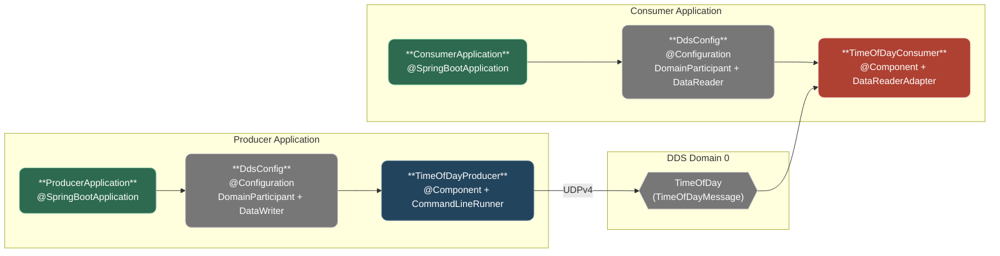

# Step 2: Spring Boot Conversion

## Goal

Convert both producer and consumer from raw Java applications into Spring Boot applications, introducing dependency injection, externalized configuration, managed lifecycle, and structured logging.

## Why Spring Boot?

[Spring Boot](https://spring.io/projects/spring-boot) is an opinionated framework built on the Spring Framework that favors convention over configuration. It is the de facto standard for building production-ready Java applications.

**What it provides out of the box:**

- **Dependency injection** — Objects are wired together by the framework, not by manual constructor calls. This decouples components and makes them independently testable.
- **Externalized configuration** — Properties files, environment variables, and command-line arguments replace hard-coded constants. Change behavior without recompilation.
- **Auto-configuration** — Spring Boot detects libraries on the classpath and configures sensible defaults automatically.
- **Managed lifecycle** — The application context handles startup ordering, graceful shutdown, and resource cleanup via annotations like `@PreDestroy`.
- **Embedded server** — No need to deploy WAR files to an external application server. The application is a self-contained JAR.
- **Structured logging** — SLF4J with Logback is auto-configured, providing timestamped, thread-aware log output.

**Why it matters for modernization:**

Spring Boot eliminates the boilerplate seen in Step 1 (manual DDS setup in `main()`, shutdown hooks, classpath assembly) and replaces it with a standardized application structure. More importantly, it unlocks the broader Spring ecosystem — actuators for monitoring (Step 3), Spring Integration for messaging abstraction (Step 4), and pluggable configuration for swapping infrastructure (Step 5).

For more detail, see the [Spring Boot Reference Documentation](https://docs.spring.io/spring-boot/reference/).

## Architecture



## What Changed from Step 1

### Configuration: Hard-coded → Externalized

Previously compiled into the source as `static final` constants, now in `application.properties`:

```properties
dds.domain-id=0
dds.topic-name=TimeOfDay
producer.publish-interval-ms=2000
producer.quotes-file=classpath:quotes.txt
```

Override any value at runtime without recompilation:

```bash
java -jar producer-1.0.0-SNAPSHOT.jar --dds.domain-id=1 --producer.publish-interval-ms=5000
```

### DDS Setup: Manual → Spring-Managed Beans

A shared `dds-support` module provides `DdsParticipantConfig` (`@Configuration`) that creates the `DomainParticipant` as a Spring bean with default QoS. Domain ID and topic name are externalized to `application.properties`. `@PreDestroy` handles orderly DDS teardown — no more manual shutdown hooks.

Each module has a slim `DdsConfig` class that creates only its specific bean:

- Producer: `TimeOfDayMessageDataWriter`
- Consumer: `TimeOfDayMessageDataReader` (with `TimeOfDayConsumer` as listener)

### Lifecycle: main() Loop → Spring Boot

- `ProducerApplication` / `ConsumerApplication` are `@SpringBootApplication` entry points
- Producer uses `CommandLineRunner` for the publish loop
- Consumer's `DataReaderAdapter` callback is a Spring `@Component` — Spring Boot keeps the application alive
- `CountDownLatch` / `awaitShutdown()` eliminated

### Packaging: Classpath Assembly → Fat JAR

- `spring-boot-maven-plugin` produces executable fat JARs
- `includeSystemScope=true` bundles `nddsjava.jar` into the fat JAR
- Run scripts simplified to `java -jar` (only native library path setup remains)

### Logging: Manual Config → Auto-Configured

- `logback.xml` removed from both producer and consumer — Spring Boot auto-configures SLF4J/Logback with sensible defaults

### DDS QoS: XML File → Default QoS

- `USER_QOS_PROFILES.xml` removed — no longer needed
- DDS participant created with default QoS (UDPv4 + SHMEM, multicast discovery)
- Domain ID and topic name externalized to `application.properties`

## Project Structure

```text
a-stultitia/
├── pom.xml                                      # Parent POM with Spring Boot BOM
├── demo/
│   ├── README.md
│   ├── bin/
│   │   ├── run-producer.sh                      # Simplified: java -jar
│   │   └── run-consumer.sh                      # Simplified: java -jar
├── idl/                                         # Unchanged from Step 1
│   ├── README.md
│   ├── pom.xml
│   └── src/main/idl/TimeOfDayMessage.idl
├── dds-support/                                 # NEW — shared DDS configuration
│   ├── README.md
│   ├── pom.xml
│   └── src/main/java/net/edwardsonthe/dds/
│       └── DdsParticipantConfig.java            # @Configuration, DomainParticipant bean
├── producer/
│   ├── README.md
│   ├── pom.xml                                  # + spring-boot-starter, spring-boot-maven-plugin
│   └── src/main/
│       ├── java/net/edwardsonthe/producer/
│       │   ├── ProducerApplication.java         # NEW — @SpringBootApplication
│       │   ├── DdsConfig.java                   # NEW — @Configuration, DataWriter bean
│       │   └── TimeOfDayProducer.java           # REWRITTEN — @Component, CommandLineRunner
│       └── resources/
│           ├── application.properties           # NEW — externalized config
│           └── quotes.txt
└── consumer/
    ├── README.md
    ├── pom.xml                                  # + spring-boot-starter, spring-boot-maven-plugin
    └── src/main/
        ├── java/net/edwardsonthe/consumer/
        │   ├── ConsumerApplication.java         # NEW — @SpringBootApplication
        │   ├── DdsConfig.java                   # NEW — @Configuration, DataReader bean
        │   └── TimeOfDayConsumer.java           # REWRITTEN — @Component, DataReaderAdapter
        └── resources/
            └── application.properties           # NEW — externalized config
```

## Build and Run

See [demo/README.md](demo/README.md) for complete build and run instructions.

Quick version:

```bash
export NDDSHOME=/path/to/rti_connext_dds-7.6.0
mvn clean package

# Terminal 1
./demo/bin/run-consumer.sh

# Terminal 2
./demo/bin/run-producer.sh
```

## Key Improvements over Step 1

| Concern           | Step 1                           | Step 2                                            |
| ----------------- | -------------------------------- | ------------------------------------------------- |
| Startup           | Shell script assembles classpath | `java -jar` (fat JAR)                             |
| Logging           | SLF4J + manual Logback config    | SLF4J + Spring Boot auto-configured Logback       |
| Configuration     | Hard-coded constants             | `application.properties` + command-line overrides |
| DDS lifecycle     | Manual shutdown hooks            | `@PreDestroy` via Spring context                  |
| Dependency wiring | Constructor calls in `main()`    | Spring constructor injection                      |
| DDS QoS           | External XML file                | Default QoS (XML removed)                         |
| Packaging         | Thin JAR + external classpath    | Self-contained fat JAR                            |

## What's Still Missing

These will be addressed in subsequent steps:

1. **No health monitoring** — Is the application running? Is DDS connected? (Step 3: Actuators)
2. **No runtime log level changes** — Must restart to change log levels (Step 3: Actuators)
3. **Tight coupling to DDS** — Business logic directly calls DDS API (Step 4: Spring Integration)
4. **Cannot swap messaging** — Changing from DDS to Kafka requires code changes (Step 5)
