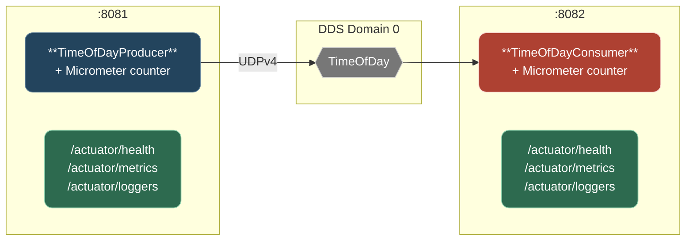

# Step 3: Spring Boot Actuators

## Goal

Add operational visibility to the producer and consumer applications — health checks, runtime log level management, application metrics, and configuration introspection — using Spring Boot Actuators.

## What Are Actuators?

[Spring Boot Actuators](https://docs.spring.io/spring-boot/reference/actuator/) are production-ready features that expose operational information about a running application via HTTP endpoints. They answer questions like:

- **Is the application healthy?** (`/actuator/health`)
- **What configuration is it running with?** (`/actuator/env`)
- **How many messages has it processed?** (`/actuator/metrics`)
- **Can I change the log level without restarting?** (`/actuator/loggers`)

Actuators require no changes to business logic — they are purely additive.

## Architecture



## What Changed from Step 2

### New Dependencies

- **`spring-boot-starter-web`** — embeds Apache Tomcat for HTTP endpoints
- **`spring-boot-starter-actuator`** — provides the actuator framework and Micrometer metrics

### Embedded Web Server

Both producer and consumer now run an embedded Tomcat alongside their DDS messaging:

- **Producer:** `server.port=8081`
- **Consumer:** `server.port=8082`

The consumer's `spring.main.keep-alive=true` (from Step 2) is no longer needed — embedded Tomcat keeps the application alive.

### Actuator Endpoints Enabled

| Endpoint     | URL                     | Purpose                                         |
| ------------ | ----------------------- | ----------------------------------------------- |
| Health       | `/actuator/health`      | Liveness check with custom DDS health indicator |
| Info         | `/actuator/info`        | Application name, description, tutorial step    |
| Loggers      | `/actuator/loggers`     | View and change log levels at runtime           |
| Metrics      | `/actuator/metrics`     | JVM, process, and custom DDS message counters   |
| Env          | `/actuator/env`         | Resolved configuration properties               |
| Beans        | `/actuator/beans`       | All Spring beans in the application context     |
| Config Props | `/actuator/configprops` | Property-to-bean binding details                |

### Custom DDS Health Indicator

A shared `DdsHealthIndicator` in the `dds-support` module implements Spring Boot's `HealthIndicator` interface. It checks the DDS `DomainParticipant` bean and reports:

```json
{
  "status": "UP",
  "components": {
    "dds": {
      "status": "UP",
      "details": {
        "domainId": 0,
        "role": "timeofday-producer"
      }
    }
  }
}
```

The class name `DdsHealthIndicator` causes Spring Boot to register it under the key `"dds"` (the `HealthIndicator` suffix is stripped automatically). The role is derived from `spring.application.name`.

### Custom Micrometer Metrics

Each module registers a custom counter via Micrometer's `MeterRegistry`:

- **Producer:** `dds.messages.published` — incremented on each successful publish
- **Consumer:** `dds.messages.received` — incremented on each valid message received

### Info Endpoint

Populated via `application.properties`:

```properties
management.info.env.enabled=true
info.app.name=${spring.application.name}
info.app.description=DDS TimeOfDay message producer
info.app.step=3 - Spring Boot Actuators
```

## Project Structure

```text
a-stultitia/
├── pom.xml                                      # Unchanged
├── demo/
│   ├── README.md
│   └── bin/
│       ├── run-producer.sh
│       └── run-consumer.sh
├── idl/                                         # Unchanged
├── dds-support/
│   ├── README.md
│   ├── pom.xml                                  # + starter-actuator
│   └── src/main/java/net/edwardsonthe/dds/
│       ├── DdsParticipantConfig.java            # Unchanged
│       └── DdsHealthIndicator.java              # NEW — shared health check
├── producer/
│   ├── README.md
│   ├── pom.xml                                  # + starter-web, starter-actuator
│   └── src/main/
│       ├── java/net/edwardsonthe/producer/
│       │   ├── ProducerApplication.java         # Unchanged
│       │   ├── DdsConfig.java                   # Unchanged
│       │   └── TimeOfDayProducer.java           # MODIFIED — Micrometer counter
│       └── resources/
│           ├── application.properties           # MODIFIED — server.port, actuator config
│           └── quotes.txt
└── consumer/
    ├── README.md
    ├── pom.xml                                  # + starter-web, starter-actuator
    └── src/main/
        ├── java/net/edwardsonthe/consumer/
        │   ├── ConsumerApplication.java         # Unchanged
        │   ├── DdsConfig.java                   # Unchanged
        │   └── TimeOfDayConsumer.java           # MODIFIED — Micrometer counter
        └── resources/
            └── application.properties           # MODIFIED — server.port, actuator config
```

## Build and Run

See [demo/README.md](demo/README.md) for complete build and run instructions.

```bash
export NDDSHOME=/path/to/rti_connext_dds-7.6.0
mvn clean package

# Terminal 1 — consumer (HTTP on port 8082)
./demo/bin/run-consumer.sh

# Terminal 2 — producer (HTTP on port 8081)
./demo/bin/run-producer.sh
```

## Demonstrating the Actuators

### Health Check

```bash
# Producer health (includes DDS status)
curl -s http://localhost:8081/actuator/health | jq .

# Consumer health
curl -s http://localhost:8082/actuator/health | jq .
```

### Application Info

```bash
curl -s http://localhost:8081/actuator/info | jq .
```

### Runtime Log Level Changes

```bash
# View current log level
curl -s http://localhost:8081/actuator/loggers/net.edwardsonthe.producer | jq .

# Change to DEBUG at runtime — no restart required
curl -X POST http://localhost:8081/actuator/loggers/net.edwardsonthe.producer \
  -H 'Content-Type: application/json' \
  -d '{"configuredLevel": "DEBUG"}'

# Reset back to default
curl -X POST http://localhost:8081/actuator/loggers/net.edwardsonthe.producer \
  -H 'Content-Type: application/json' \
  -d '{"configuredLevel": null}'
```

### Custom Metrics

```bash
# Published message count
curl -s http://localhost:8081/actuator/metrics/dds.messages.published | jq .

# Received message count
curl -s http://localhost:8082/actuator/metrics/dds.messages.received | jq .
```

### List All Available Endpoints

```bash
curl -s http://localhost:8081/actuator | jq .
```

## Key Improvements over Step 2

| Concern           | Step 2           | Step 3                                           |
| ----------------- | ---------------- | ------------------------------------------------ |
| Health monitoring | None             | `/actuator/health` with custom DDS indicator     |
| Log level changes | Requires restart | `/actuator/loggers` — change at runtime via POST |
| Message metrics   | None             | Micrometer counters: published/received counts   |
| Config visibility | Read files       | `/actuator/env` and `/actuator/configprops`      |
| Application info  | None             | `/actuator/info` with app name and description   |
| HTTP server       | None             | Embedded Tomcat on configurable port             |

## Production Considerations

This tutorial exposes actuator endpoints without authentication for simplicity. In production:

- Use **Spring Security** to protect actuator endpoints
- Place actuators on a **separate management port** (`management.server.port`)
- Use `management.endpoints.web.exposure.include` to expose only what is needed
- Set `management.endpoint.health.show-details=when-authorized` instead of `always`

## What's Still Missing

These will be addressed in subsequent steps:

1. **Tight coupling to DDS** — Business logic directly calls DDS API; swapping messaging requires code changes (Step 4: Spring Integration)
2. **Cannot swap messaging via config** — Changing from DDS to Kafka requires rewriting producer and consumer (Step 5)
