# Step 4: Spring Integration

## Goal

Decouple the producer and consumer business logic from the RTI DDS messaging API by introducing Spring Integration as an abstraction layer. After this step, the business logic has zero dependency on DDS — making it possible to swap the underlying messaging transport (Step 5) without changing any application code.

## Why Spring Integration?

[Spring Integration](https://spring.io/projects/spring-integration) implements the patterns described in _Enterprise Integration Patterns_ (Hohpe & Woolf) within the Spring ecosystem. It provides:

- **Message Channels** — named pipes that decouple message producers from consumers
- **Channel Adapters** — bridges between channels and external systems (DDS, Kafka, JMS, etc.)
- **Service Activators** — Spring beans that process messages arriving on a channel
- **Profiles** — `@Profile` controls which adapters are active at runtime

The key insight is that **business logic interacts only with channels and POJOs**, never with transport-specific types.

## Architecture

```mermaid
flowchart LR
  classDef shade1 fill:#23445D,stroke:#5D7F99,rx:10,color:#FFFFFF
  classDef shade2 fill:#AE4132,stroke:#FAD9D5,rx:10,color:#FFFFFF
  classDef shade3 fill:#777777,stroke:#CCCCCC,rx:10,color:#FFFFFF
  classDef shade4 fill:#2D6A4F,stroke:#95D5B2,rx:10,color:#FFFFFF

  subgraph Producer Application
    direction LR
    PP["**TimeOfDayProducer**<br/>sends TimeOfDayEvent"]
    OC["outboundChannel"]
    OA["**DdsOutboundAdapter**<br/>@Profile(dds)"]
    PP --> OC --> OA
  end

  subgraph DDS
    Topic{{"TimeOfDay"}}
  end

  subgraph Consumer Application
    direction RL
    IA["**DdsInboundAdapter**<br/>@Profile(dds)"]
    IC["inboundChannel"]
    CC["**TimeOfDayConsumer**<br/>@ServiceActivator"]
    IA --> IC --> CC
  end

  OA -- "UDPv4" --> Topic --> IA

  class PP shade1
  class CC shade2
  class Topic shade3
  class OA,IA shade4
  class OC,IC shade3
```



## What Changed from Step 3

### New Module: `common/`

Contains the transport-neutral `TimeOfDayEvent` POJO — shared by all modules. Zero dependencies on DDS, Kafka, or any messaging framework.

### Expanded Module: `dds-support/`

Expanded with Spring Integration channel adapters and role-specific DDS configs:

| Class                       | Role                                                         |
| --------------------------- | ------------------------------------------------------------ |
| `DdsAutoConfiguration`      | Auto-configuration entry point, enables component scanning   |
| `DdsParticipantConfig`      | Shared: DomainParticipant, Topic, type registration, cleanup |
| `DdsProducerConfig`         | Role-specific: Publisher + DataWriter (`dds.role=producer`)  |
| `DdsConsumerConfig`         | Role-specific: Subscriber + DataReader (`dds.role=consumer`) |
| `DdsOutboundChannelAdapter` | Channel → DDS: converts `TimeOfDayEvent` to DDS and writes   |
| `DdsInboundChannelAdapter`  | DDS → Channel: converts DDS to `TimeOfDayEvent` and sends    |
| `DdsHealthIndicator`        | Actuator health check for DomainParticipant status           |

All classes are annotated with `@Profile("dds")`. The `dds.role` property controls which role-specific beans are created.

### Auto-Configuration

The `dds-support` module registers itself via Spring Boot's auto-configuration mechanism (`META-INF/spring/org.springframework.boot.autoconfigure.AutoConfiguration.imports`). This means `@SpringBootApplication` no longer needs `scanBasePackages` — the transport module is self-configuring when present on the classpath and the `dds` profile is active.

### Producer and Consumer Simplified

With DDS code extracted to the transport module, producer and consumer are now **transport-agnostic**:

**Producer sends to a channel:**

```java
// Before (Step 3) — direct DDS API:
writer.write(ddsMessage, InstanceHandle_t.HANDLE_NIL);

// After (Step 4) — sends POJO to channel:
outboundChannel.send(MessageBuilder.withPayload(event).build());
```

**Consumer receives via `@ServiceActivator`:**

```java
// Before (Step 3) — extends DataReaderAdapter:
public class TimeOfDayConsumer extends DataReaderAdapter { ... }

// After (Step 4) — plain Spring component:
@ServiceActivator(inputChannel = "timeOfDayInboundChannel")
public void handleMessage(Message<TimeOfDayEvent> message) { ... }
```

**Application classes simplified:** `scanBasePackages` removed from `@SpringBootApplication` — transport modules are now discovered automatically via auto-configuration.

**Removed from producer and consumer:** `DdsConfig.java` — moved to `dds-support`

### Metric Names

Changed from `dds.messages.published` / `dds.messages.received` to `messages.published` / `messages.received` — they are no longer DDS-specific since business logic is transport-agnostic.

## Project Structure

```text
a-stultitia/
├── pom.xml                                          # MODIFIED — added common, renamed module
├── demo/
│   ├── README.md
│   └── bin/
│       ├── run-producer.sh
│       └── run-consumer.sh
├── common/                                          # NEW — shared domain types
│   ├── README.md
│   ├── pom.xml
│   └── src/main/java/net/edwardsonthe/common/
│       └── TimeOfDayEvent.java
├── idl/                                             # Unchanged
├── dds-support/                                     # EXPANDED — channel adapters added
│   ├── README.md
│   ├── pom.xml
│   └── src/main/
│       ├── java/net/edwardsonthe/dds/
│       │   ├── DdsAutoConfiguration.java            # NEW — auto-configuration entry point
│       │   ├── DdsParticipantConfig.java
│       │   ├── DdsProducerConfig.java               # NEW
│       │   ├── DdsConsumerConfig.java               # NEW
│       │   ├── DdsOutboundChannelAdapter.java       # NEW
│       │   ├── DdsInboundChannelAdapter.java        # NEW
│       │   └── DdsHealthIndicator.java
│       └── resources/META-INF/spring/
│           └── ...AutoConfiguration.imports         # NEW
├── producer/                                        # SIMPLIFIED — transport-agnostic
│   ├── README.md
│   ├── pom.xml
│   └── src/main/
│       ├── java/net/edwardsonthe/producer/
│       │   ├── ProducerApplication.java
│       │   ├── IntegrationConfig.java               # NEW — outbound channel
│       │   └── TimeOfDayProducer.java               # REWRITTEN — sends to channel
│       └── resources/
│           ├── application.properties               # MODIFIED — profiles, dds.role
│           └── quotes.txt
└── consumer/                                        # SIMPLIFIED — transport-agnostic
    ├── README.md
    ├── pom.xml
    └── src/main/
        ├── java/net/edwardsonthe/consumer/
        │   ├── ConsumerApplication.java
        │   ├── IntegrationConfig.java               # NEW — inbound channel
        │   └── TimeOfDayConsumer.java               # REWRITTEN — @ServiceActivator
        └── resources/
            └── application.properties               # MODIFIED — profiles, dds.role
```

## Build and Run

```bash
export NDDSHOME=/path/to/rti_connext_dds-7.6.0
mvn clean package

# Terminal 1 — consumer (HTTP on port 8082)
./demo/bin/run-consumer.sh

# Terminal 2 — producer (HTTP on port 8081)
./demo/bin/run-producer.sh
```

The applications now log the active profile on startup:

```text
INFO --- n.e.consumer.ConsumerApplication : The following 1 profile is active: "dds"
```

## How This Enables Step 5

The entire transport swap in Step 5 requires:

1. Add Kafka adapter beans with `@Profile("kafka")`
2. Change `spring.profiles.active=kafka` in properties

**Zero changes to:**

- `TimeOfDayProducer` — still sends to `timeOfDayOutboundChannel`
- `TimeOfDayConsumer` — still receives from `timeOfDayInboundChannel`
- `IntegrationConfig` — channels are transport-agnostic
- `TimeOfDayEvent` — the POJO doesn't change
- `dds-support/` — DDS transport still works with `--spring.profiles.active=dds`

## Key Improvements over Step 3

| Concern            | Step 3                    | Step 4                                        |
| ------------------ | ------------------------- | --------------------------------------------- |
| Business logic     | Directly calls DDS API    | Sends/receives via channels, zero DDS imports |
| Transport swap     | Requires code changes     | Profile-based: change one property            |
| Message model      | DDS `TimeOfDayMessage`    | Transport-neutral `TimeOfDayEvent` POJO       |
| DDS code isolation | Mixed with business logic | Isolated in `dds-support` module              |
| Code duplication   | DDS config in each module | Single shared transport module                |
| Testability        | Requires running DDS      | Business logic testable with mock channels    |

## What's Still Missing

The final step demonstrates the payoff of this abstraction:

- **Step 5:** Swap DDS for Kafka by adding Kafka adapters under `@Profile("kafka")` and changing `spring.profiles.active` — proving that the messaging transport is truly configuration-driven.
